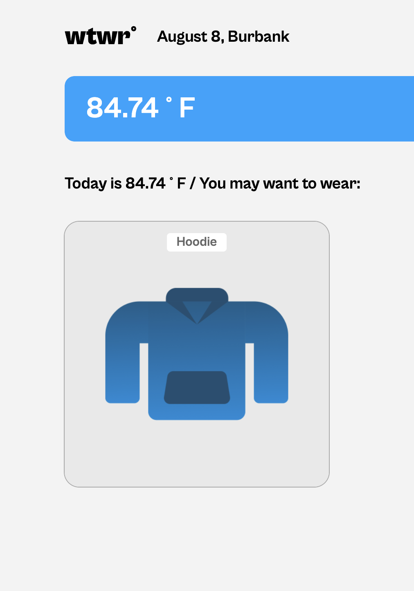

** WTWR (What To Wear) **

** Description **

- WTWR is a full-stack web application designed to help users choose appropriate clothing based on real-time weather data. The app fetches weather information from a Weather API and provides personalized clothing recommendations to keep users comfortable and stylish in any climate.

- This project focuses on the front-end implementation using React class components, emphasizing core React principles such as state management, component lifecycle, and props. The UI includes a responsive header, interactive clothing cards, and modal windows for adding new garments and previewing details.

** Features **

- Fetches and displays current weather data for a specified location.

- Recommends clothing items suitable for the weather conditions.

- Interactive cards display clothing items with images and descriptions.

- Modal windows allow users to add new clothing items and view details.

- Responsive design for seamless use across desktop, tablet, and mobile devices.

** Technologies Used **

- React (Class Components) — for building the user interface and managing state.

- JavaScript (ES6+) — core programming language.

- CSS / Flexbox / Grid — for responsive and accessible styling.

- Weather API — to retrieve live weather data (e.g., OpenWeatherMap).

- Vite — fast build tool and development server for modern web projects.

- Git & GitHub — version control and code hosting.

** Screenshots / Demo **

** Live Demo **
Check out the live application here: https://williamhasrouty.github.io/se_project_react/
https://github.com/williamhasrouty/se_project_express
